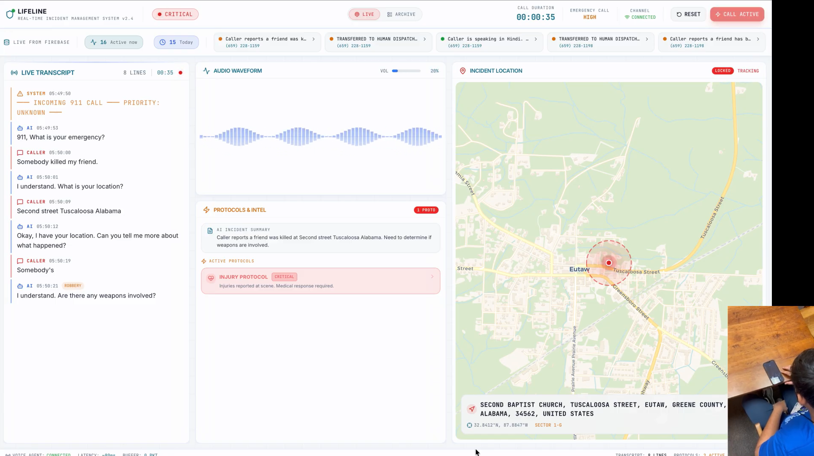

<div align="center">

# 🚨 LIFELINE

### *Zero Hold Time. Every Second Counts.*

<br />



<br />

**A voice-first AI emergency dispatching system that picks up when 911 lines are flooded,**
**gathers critical intel through natural dialogue, and feeds a real-time dispatch dashboard—**
**so no caller is ever left listening to a busy signal.**

<br />

[](https://devpost.com/software/the-second-responder)
[](https://youtu.be/gidrWDmyPAY)
[](#awards)
[](#awards)

<br />

[**Watch the Demo**](https://youtu.be/gidrWDmyPAY) · [**Devpost Submission**](https://devpost.com/software/the-second-responder) · [**Architecture**](#architecture) · [**Getting Started**](#getting-started)

</div>

---

## The Problem

> *Living in the south, tornado sirens are a part of life. But what really scares us isn't the storm — it's the stories of people calling 911 during a crisis and getting a busy signal because the lines are flooded.*

During mass-casualty events, natural disasters, and large-scale emergencies, **911 call centers are overwhelmed**. The bottleneck isn't the number of ambulances — it's the number of people available to answer the phone. Callers in life-threatening situations hear ringing, or worse, a busy signal.

## The Solution

**Lifeline** is an AI dispatch assistant that picks up **immediately** when human operators are busy. It speaks naturally in **29+ languages**, gathers location and emergency details through calm, structured dialogue, then prioritizes incidents on a **real-time dashboard** for human dispatchers.

> It doesn't replace operators — it handles intake so no caller is left waiting.

---

## Demo

<div align="center">

[](https://youtu.be/gidrWDmyPAY)

</div>

---

## Key Features

| Feature | Description |
|---|---|
| **🕐 Zero Hold Time** | AI answers immediately when human lines are busy — no caller left waiting |
| **🌍 29+ Languages** | Automatic language detection and response via ElevenLabs multilingual TTS |
| **🧠 Intelligent Triage** | Gemini 2.0 Flash extracts structured data: location, incident type, injuries, weapons, suspects |
| **📊 Real-Time Dashboard** | Live transcript, interactive incident map, protocol engine, and resource dispatch |
| **🗺️ Auto-Geocoding** | Caller-mentioned addresses are geocoded and pinned on a live Leaflet map |
| **🔥 Protocol Engine** | Automatic protocol activation (Fire, Medical, Robbery, Assault, Kidnapping) with priority escalation |
| **📞 Caller Sentiment** | Real-time emotional state analysis to prioritize distressed callers |
| **💾 Persistent Records** | Every call, transcript, and intel extraction is stored in Firebase Realtime Database |
| **🎙️ Audio Visualization** | Live waveform display of call audio with volume normalization |
| **👤 Human-in-the-Loop** | AI gathers intel → human dispatchers make decisions. Safety by design. |

---

<a id="architecture"></a>

## Architecture

```
┌─────────────────────────────────────────────────────────────────────────────┐
│                           LIFELINE — SYSTEM ARCHITECTURE                    │
└─────────────────────────────────────────────────────────────────────────────┘

    ┌──────────┐         ┌──────────────────────────────────────────┐
    │  CALLER  │────────▶│              TWILIO                      │
    │  (Phone) │  PSTN   │  Voice Webhook + Media Stream (mulaw)    │
    └──────────┘         └──────────────┬───────────────────────────┘
                                        │
                                        │ WebSocket (wss://)
                                        │ Raw audio stream (mulaw 8kHz)
                                        ▼
    ┌───────────────────────────────────────────────────────────────────────┐
    │                      NODE.JS SERVER (Fastify)                        │
    │                                                                       │
    │  ┌─────────────────┐    ┌──────────────────┐    ┌─────────────────┐  │
    │  │  /incoming-call  │    │  /media-stream    │    │   /dashboard    │  │
    │  │  (TwiML webhook) │    │  (Twilio WS)      │    │   (Dashboard WS)│  │
    │  └────────┬────────┘    └────────┬─────────┘    └────────┬────────┘  │
    │           │                      │                       │            │
    │           │              ┌───────▼────────┐              │            │
    │           │              │  Audio Buffer   │              │            │
    │           │              │  + Silence Det.  │              │            │
    │           │              └───────┬────────┘              │            │
    │           │                      │                       │            │
    │           │              ┌───────▼────────┐              │            │
    │           │              │  WAV Encoding   │              │            │
    │           │              │  (mulaw → PCM)  │              │            │
    │           │              └───────┬────────┘              │            │
    │           │                      │                       │            │
    │  ┌───────▼──────────────────────▼───────────────────────▼──────────┐ │
    │  │                     AI PROCESSING PIPELINE                       │ │
    │  │                                                                   │ │
    │  │  ┌─────────────────┐  ┌──────────────┐  ┌─────────────────────┐ │ │
    │  │  │  GEMINI 2.0     │  │  SENTIMENT   │  │   NOMINATIM         │ │ │
    │  │  │  FLASH          │  │  ANALYSIS    │  │   GEOCODING         │ │ │
    │  │  │                 │  │              │  │                     │ │ │
    │  │  │  • Transcribe   │  │  • Emotional │  │  • Address → lat/  │ │ │
    │  │  │  • Classify     │  │    state     │  │    lng coords      │ │ │
    │  │  │  • Extract intel│  │  • Priority  │  │  • Sector mapping  │ │ │
    │  │  │  • Generate     │  │    weight    │  │  • Display name    │ │ │
    │  │  │    response     │  │              │  │                     │ │ │
    │  │  └────────┬────────┘  └──────┬───────┘  └──────────┬──────────┘ │ │
    │  │           │                  │                      │            │ │
    │  │           └──────────────────┼──────────────────────┘            │ │
    │  │                              │                                    │ │
    │  │                    ┌─────────▼──────────┐                        │ │
    │  │                    │   STRUCTURED JSON   │                        │ │
    │  │                    │   { transcript,     │                        │ │
    │  │                    │     scenario,       │                        │ │
    │  │                    │     reply, intel,   │                        │ │
    │  │                    │     sentiment,      │                        │ │
    │  │                    │     is_final }      │                        │ │
    │  │                    └─────────┬──────────┘                        │ │
    │  └──────────────────────────────┼──────────────────────────────────┘ │
    │                                 │                                     │
    │           ┌─────────────────────┼─────────────────────┐              │
    │           │                     │                     │              │
    │           ▼                     ▼                     ▼              │
    │  ┌──────────────┐    ┌──────────────────┐   ┌─────────────────┐    │
    │  │  ELEVENLABS  │    │    FIREBASE       │   │   DASHBOARD WS  │    │
    │  │  TTS         │    │    RTDB            │   │   BROADCAST     │    │
    │  │              │    │                    │   │                 │    │
    │  │  AI reply →  │    │  • Call records   │   │  • transcript   │    │
    │  │  natural     │    │  • Messages       │   │  • intel        │    │
    │  │  voice       │    │  • Intel data     │   │  • volume       │    │
    │  │  (mulaw)     │    │  • Summaries      │   │  • call_start   │    │
    │  └──────┬───────┘    └──────────────────┘   │  • call_end     │    │
    │         │                                    └────────┬────────┘    │
    │         │ Audio stream back                           │             │
    │         ▼                                             │             │
    │  ┌──────────────┐                                     │             │
    │  │   TWILIO WS  │                                     │             │
    │  │  (outbound)  │                                     │             │
    │  └──────┬───────┘                                     │             │
    └─────────┼─────────────────────────────────────────────┼─────────────┘
              │                                             │
              ▼                                             ▼
    ┌──────────────┐                         ┌──────────────────────────┐
    │   CALLER     │                         │   DISPATCH CENTER        │
    │   hears AI   │                         │   (Next.js Dashboard)    │
    │   response   │                         │                          │
    └──────────────┘                         │  ┌────────┬──────────┐  │
                                             │  │ Live   │ Incident │  │
                                             │  │Transcr.│   Map    │  │
                                             │  ├────────┼──────────┤  │
                                             │  │ Audio  │ Intel    │  │
                                             │  │  Viz   │  Deck    │  │
                                             │  ├────────┴──────────┤  │
                                             │  │   Call Archive    │  │
                                             │  └───────────────────┘  │
                                             └──────────────────────────┘
```

### Data Flow — A Single 911 Call

```
1. RING ──▶  Caller dials 911, Twilio routes to /incoming-call
2. GREET ──▶  TwiML responds: "911, What is your emergency?"
3. STREAM ──▶  Twilio opens WebSocket, streams raw mulaw audio
4. LISTEN ──▶  Server buffers audio, detects silence (end of utterance)
5. THINK ──▶  Audio → WAV → Gemini 2.0 Flash (transcribe + classify + extract)
6. SPEAK ──▶  AI reply → ElevenLabs TTS → mulaw stream back to caller
7. PUSH  ──▶  Structured intel → Firebase RTDB + WebSocket → Dashboard
8. LOOP  ──▶  Steps 4–7 repeat until checklist complete
9. END   ──▶  "Help is on the way." → Call marked as ended → Units dispatched
```

---

## Tech Stack

<div align="center">

### Backend — AI Phone Agent

| Technology | Role |
|:---:|:---|
|  **Node.js + Fastify** | High-performance HTTP + WebSocket server |
|  **Gemini 2.0 Flash** | Audio transcription, intent classification, structured data extraction |
|  **ElevenLabs** | Multilingual text-to-speech with `eleven_multilingual_v2` |
|  **Twilio** | Phone number, voice webhooks, bidirectional media streams |
|  **Firebase RTDB** | Persistent call logs, messages, intel summaries |
|  **Nominatim** | Address → lat/lng geocoding for map pins |

### Frontend — Dispatch Center

| Technology | Role |
|:---:|:---|
|  **Next.js 14** | React framework with App Router |
|  **TypeScript** | End-to-end type safety |
|  **Tailwind CSS** | Utility-first styling with custom dispatch theme |
|  **Framer Motion** | Smooth animations and transitions |
|  **React Leaflet** | Interactive incident map with real-time markers |
|  **Radix UI** | Accessible, unstyled component primitives |

</div>

---

## Project Structure

```
lifeline/
│
├── 📡 ai-phone-agentjs/            # Backend — AI Voice Agent
│   ├── index.js                     # Main server: Twilio WS, Gemini AI pipeline,
│   │                                #   ElevenLabs TTS, dashboard broadcast, geocoding
│   ├── firebase.js                  # Firebase RTDB: initCall, saveMessage,
│   │                                #   updateCallSummary, endCall
│   ├── start.js                     # Multi-process launcher
│   ├── simple_speak.js              # Standalone TTS test utility
│   ├── test_eleven.js               # ElevenLabs API test
│   ├── manual_stream.js             # Manual audio stream testing
│   └── package.json
│
├── 🖥️ dispatch-center/              # Frontend — Next.js Dispatch Dashboard
│   ├── src/
│   │   ├── app/
│   │   │   ├── page.tsx             # Root page → renders <Dashboard />
│   │   │   ├── calls/page.tsx       # Dedicated call history page
│   │   │   ├── layout.tsx           # Root layout with fonts & metadata
│   │   │   └── globals.css          # Tailwind + custom dispatch theme vars
│   │   │
│   │   ├── components/
│   │   │   ├── Dashboard.tsx        # Main orchestrator: mode toggle, header,
│   │   │   │                        #   Firebase strip, bento grid layout
│   │   │   ├── LiveTranscript.tsx   # Real-time scrolling call transcript
│   │   │   ├── AudioVisualizer.tsx  # Waveform visualization of call audio
│   │   │   ├── IntelDeck.tsx        # Protocol engine + resource dispatch cards
│   │   │   ├── IncidentMap.tsx      # Leaflet map wrapper with overlays
│   │   │   ├── MapContent.tsx       # Leaflet tile layer + marker logic
│   │   │   ├── CallHistoryDashboard.tsx  # Archive view with search & filters
│   │   │   ├── StatusBadge.tsx      # Animated status indicator
│   │   │   └── ui/                  # Radix-based primitives (card, badge, etc.)
│   │   │
│   │   ├── hooks/
│   │   │   ├── useVoiceStream.ts    # WebSocket hook for live AI voice agent
│   │   │   ├── useFirebaseCalls.ts  # Real-time Firebase call listener
│   │   │   └── useMockStream.ts     # Demo mode simulated call data
│   │   │
│   │   └── lib/
│   │       ├── firebase.ts          # Firebase client initialization
│   │       └── utils.ts             # cn() and shared utilities
│   │
│   ├── tailwind.config.ts
│   ├── next.config.mjs
│   └── package.json
│
├── 🖼️ Assets/
│   └── image.png                    # Project banner / screenshot
│
└── 📄 README.md
```

---

## Getting Started

### Prerequisites

- **Node.js** v18+
- **Twilio** account with a phone number
- **Google Cloud** API key (Gemini AI access)
- **ElevenLabs** API key
- **Firebase** project with Realtime Database enabled
- **ngrok** (or any tunneling service for local dev)

### 1. Clone & Install

```bash
git clone https://github.com/your-org/lifeline.git
cd lifeline
```

```bash
# Backend
cd ai-phone-agentjs && npm install

# Frontend
cd ../dispatch-center && npm install
```

### 2. Configure Environment

**`ai-phone-agentjs/.env`**

```env
GOOGLE_API_KEY=your_google_api_key
ELEVENLABS_API_KEY=your_elevenlabs_api_key
TWILIO_ACCOUNT_SID=your_twilio_account_sid
TWILIO_AUTH_TOKEN=your_twilio_auth_token
TWILIO_PHONE_NUMBER=your_twilio_phone_number
PUBLIC_DOMAIN=your_ngrok_url_or_domain
PORT=5050
```

**`dispatch-center/.env.local`**

```env
NEXT_PUBLIC_FIREBASE_API_KEY=your_firebase_api_key
NEXT_PUBLIC_FIREBASE_AUTH_DOMAIN=your_firebase_auth_domain
NEXT_PUBLIC_FIREBASE_PROJECT_ID=your_firebase_project_id
NEXT_PUBLIC_FIREBASE_STORAGE_BUCKET=your_firebase_storage_bucket
NEXT_PUBLIC_FIREBASE_MESSAGING_SENDER_ID=your_firebase_messaging_sender_id
NEXT_PUBLIC_FIREBASE_APP_ID=your_firebase_app_id
```

### 3. Start the Services

```bash
# Terminal 1 — AI Phone Agent
cd ai-phone-agentjs
npm start
# → Server on :5050, dashboard WS on ws://localhost:5050/dashboard

# Terminal 2 — Dispatch Dashboard
cd dispatch-center
npm run dev
# → Dashboard on http://localhost:3000

# Terminal 3 — Tunnel (for Twilio webhooks)
ngrok http 5050
# → Copy the https URL to .env PUBLIC_DOMAIN
```

### 4. Configure Twilio

In your [Twilio Console](https://console.twilio.com), set your phone number's webhook:

| Setting | Value |
|---|---|
| **Voice webhook URL** | `https://your-ngrok-url.ngrok.io/incoming-call` |
| **Method** | `POST` |

**That's it.** Call your Twilio number and watch the dashboard light up.

---

## AI Pipeline Deep Dive

### Gemini Prompt Engineering

The AI agent follows **scenario-based checklists** to gather structured information:

| Scenario | Checklist |
|---|---|
| 🔫 **Robbery** | Location → Time of incident → Suspect description |
| 🏥 **Medical** | Location → Symptoms → Patient info |
| 👤 **Kidnapping** | Location → Time last seen → Suspect/vehicle info |
| 🔥 **Fire** | Location → People inside → Injuries |
| ⚔️ **Assault** | Location → Weapon → Injuries → Suspect info |

**Safety guardrails built in:**
- One-shot rule: each question asked only once to prevent loops
- Termination protocol: structured call ending with "Help is on the way"
- Echo detection: prevents AI from repeating caller's words back
- Language mirroring: responds in the caller's language automatically

### Structured Output

Every Gemini response returns a JSON object:

```json
{
  "transcript": "There's a fire at 123 Main Street",
  "scenario_detected": "FIRE",
  "reply": "I'm dispatching fire units now. Are there people inside the building?",
  "is_final": false,
  "caller_sentiment": "distressed",
  "intel": {
    "location_mentioned": "123 Main Street",
    "priority": "HIGH",
    "injuries_reported": false,
    "weapons_involved": false,
    "people_in_danger": true,
    "key_details": "Structure fire reported at 123 Main Street. Caller is distressed. Checking for occupants."
  }
}
```

---

## Dashboard Views

### Live Mode
Real-time monitoring of active calls with four panels:
- **Live Transcript** — Scrolling caller/AI dialogue with timestamps
- **Audio Visualizer** — Waveform display of call audio levels
- **Intel Deck** — Active protocols, priority badges, AI incident summary
- **Incident Map** — Leaflet map with geocoded caller location and sector overlay

### Archive Mode
Browse historical calls from Firebase with:
- Search and filter by incident type, priority, or caller number
- Full transcript replay for each call
- Extracted intel summaries and location data

---

<a id="awards"></a>

## Awards

<div align="center">

| 🏆 | Award |
|:---:|:---|
| 🥇 | **[MLH] Best Use of ElevenLabs** — UGAHacks 11 |

</div>

---

## Team

<div align="center">

| | Name |
|:---:|:---|
| 👨‍💻 | **Gaurav Shrivastava** |
| 👨‍💻 | **Priyanshu Sethi** |
| 👩‍💻 | **Kavya Gupta** |
| 👨‍💻 | **Pranay Joshi** |

</div>

---

## What's Next

- **SMS Integration** — For situations where the caller can't speak aloud
- **Multi-call concurrency** — Handle multiple simultaneous emergency calls
- **Dispatcher assignment** — Route prioritized calls to specific operators
- **Call recording & playback** — Audio archive with transcript alignment
- **Mobile companion app** — Push notifications for dispatchers on the go

---

<div align="center">

**Built with urgency at [UGAHacks 11](https://ugahacks.com) — February 2026**

*Because when seconds matter, no one should hear a busy signal.*

<br />

[](https://devpost.com/software/the-second-responder)
[](https://youtu.be/gidrWDmyPAY)

</div>
